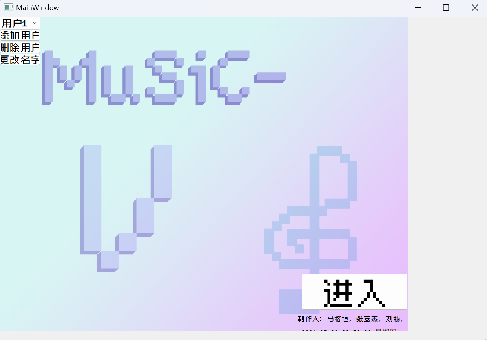
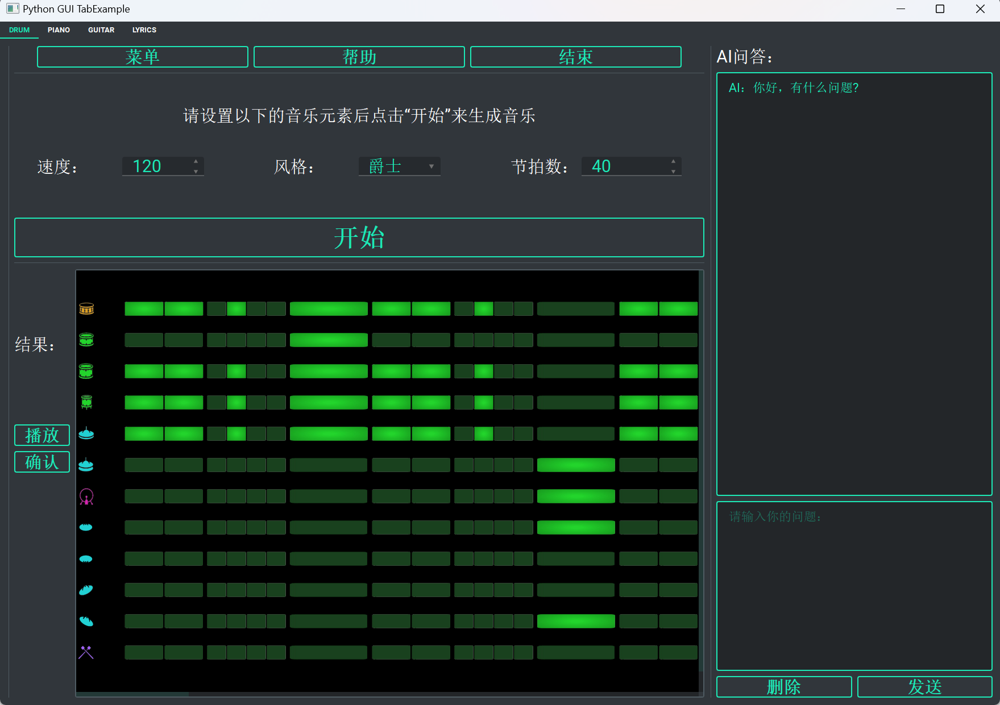
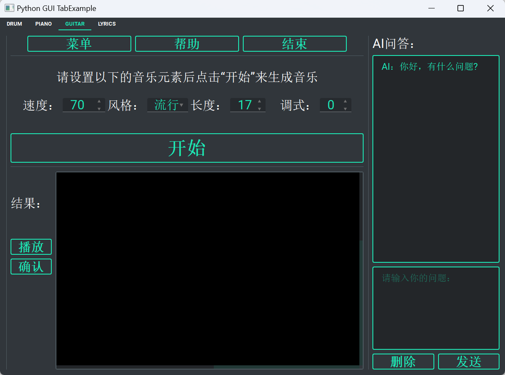
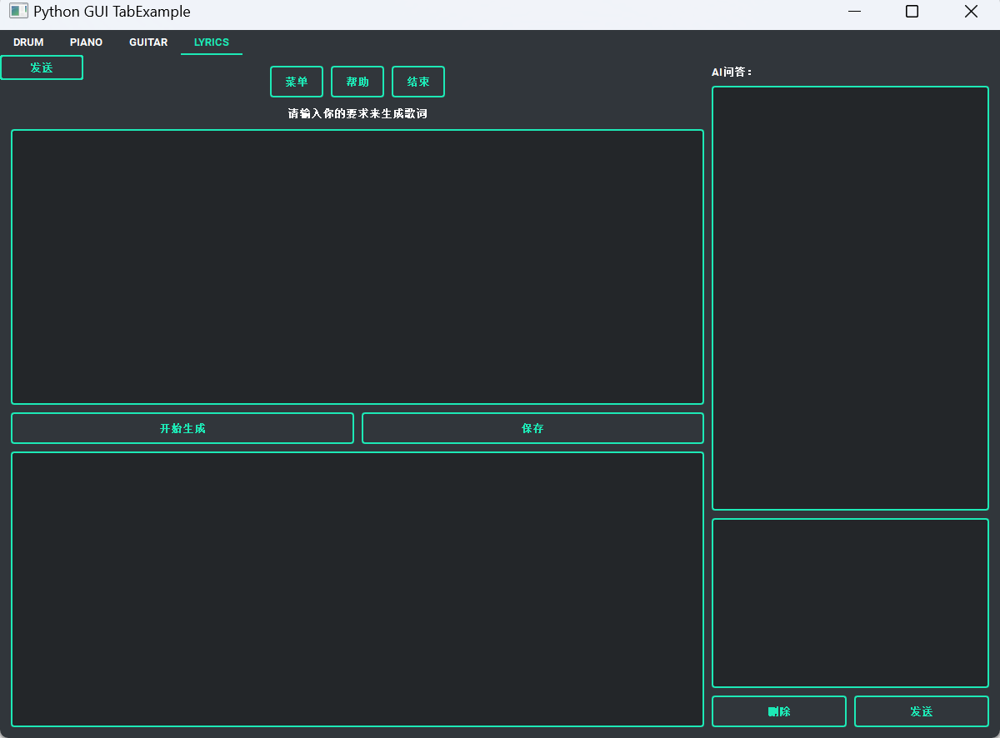
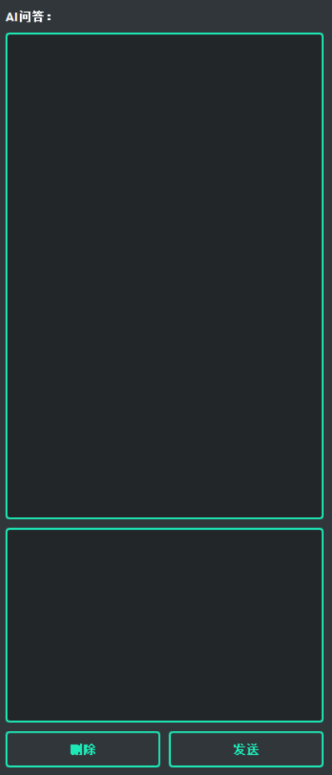

# MSVC（MuSiC-V）

## 1.项目简介

本项目接入了AI用于音乐的辅助创作，为音乐爱好者，特别是有意于进行音乐创作的群体提供一个简单易用、界面友好的应用程序，而非市面上大多数具有学习门槛、专业化程度高的应用软件。用户可以根据AI生成的内容进行简单的修改，并选择保存自己满意的音乐。

#### 功能

* AI创作乐曲: 提供限制（速度、小节、调性、风格）。
* AI创作歌词。
* 创作时可以实时AI问答。
* 将创作的内容可视化 + 可播放。
* 乐器：吉他、打击乐器（架子鼓、牛铃、三角铁）、钢琴……
* 用户友好，可选择用户并在对应文件夹下保存音乐。

## 2.项目说明

#### 开始菜单

  界面左上角选择用户身份，可以自主添加、修改、删除。

  界面右下角点击“开始”，即可开始使用。

  请自行选择你心怡的乐曲的速度、风格、节拍数。速度区间：[70, 120]，节拍数区间：[17, 61]（节拍数为 $4n+1$ 的谱子更好听哟 ~ ）

#### 鼓谱生成

  由于打击乐器的基本组成音比较有限，用户只需要提供期望的风格与长度即可。我们将提示AI每种音色的代表字母，以规范格式化输出。我们将可视化呈现基本单元，同时可以修改、实时播放、保存。

  点击“生成”，稍作等待，即可获得你想要的谱子。在生成结果中，谱子从上到下依次代表：军鼓、鼓边、中高音嗵鼓、中低音嗵鼓、落地嗵鼓、低音大鼓、闭音踩镲、开音踩镲、叮叮镲边、叮叮镲尖。

  点击色块可以调整特定位置的特定部位的敲击与否

#### 吉他谱生成
  1. 通过用户提供希望得到的乐曲片段的音调、速度、小节数，利用AI生成一段伴奏。通过格式化处理文本，以和弦为基本单元呈现给用户。
  2. 同样，提供可视化呈现界面，允许用户实时播放。
  3. 最后，用户可以在可视化界面上自由修改和弦的位置、类型，并实时保存。

  点击“生成”，稍作等待，即可获得你想要的谱子。在生成结果中，谱子显示了每个小节的和弦类型。如果你要修改和弦，可以点击色块进行修改。
  修改包括：增加、删除以及修改和弦类型。

#### 钢琴谱生成
  与吉他类似，用户提供音调、速度、小节数，通过AI生成一段钢琴旋律，同样具有可视化界面与修改功能。
  点击“生成”，稍作等待，即可获得你想要的钢琴谱。在生成结果中，谱子显示了每拍上的音符。如果你要修改音符，可以点击色块进行修改。
  修改包括：增加、删除以及修改音符长度。

#### 歌词生成
  歌词创作：用户表达预期的风格以及歌词的情感，通过调用通义千问的API，实现歌词的呈现。
  点击“生成”，稍作等待，即可获得你想要的歌词。在生成结果中呈现了AI生成的歌词。

#### AI问答
  在界面的侧边栏，我们单独开辟了一块AI问答窗口。文本框内输入问题，AI会根据问题进行回答。创作时，用户可以参考AI的回答，可以加深对于音乐的理解。

## 3.项目结构


## 4.效果展示

```开始界面：```
<initpage>

```鼓谱生成界面：```
<drum>

```吉他谱生成界面：```
<guitar>

```钢琴谱生成界面：```
<piano>

```歌词生成界面：```
<lyrics>

```AI问答界面：```
<AIQA>

## 5.关于我们

#### 分工

`朱善哲` + `刘杨`: 前端设计

`张嘉杰` + `马楷恒`: 底层算法 

#### 我们想说：

>````
>通用型人工智能虽然知识广博，但一旦涉及到更深层次的专业领域，就容易显得“呆呆的”。举例而言，对于我负责的钢琴部分，不仅需要大量的提示词来确保AI能够按照我们设定的格式生成钢琴谱，有时所谓的创作只呈现出简单的音阶，令人咋舌。组长马楷恒提出的“自由修改”部分，我刚开始认为只是锦上添花，后来发现这是非常有必要的——假如你真的想创作“音乐”的话。也就是说，比起AI独立生成，AI与人的协作也许是更好的选择；在“涌现”的AI让人们担忧未来的同时，我们理应对AI“祛魅”——归根结底，它只是个工具。
>````
