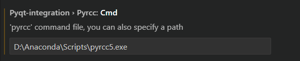

# PyQt配置

## 1.下载PyQt5 / pyqt5_tools

* 在终端中运行命令：

  ```
  pip install PyQt5 -i https://pypi.tuna.tsinghua.edu.cn/simple/
  pip install pyqt5_tools -i https://pypi.tuna.tsinghua.edu.cn/simple/
  ```

* 或者先配置全局下载地址：

  ```
  pip config set global.index_url https://pypi.tuna.tsinghua.edu.cn/simple/
  # 然后直接 pip install
  pip install PyQt5
  pip install pyqt5_tools
  ```

## 2.添加环境变量

* 找到下载的PyQt5和pyqt5_tools包：路径一般为\<python path\>\Lib\site-packages\\<PyQt5/pyqt5_tools\>

  

* 复制路径，添加到环境变量path中

  

## 3.添加PyQt工具到IDE中

### VsCode

* 安装VsCode相关插件PYQT Integration

  

* 进行扩展设置

  

* pyrcc路径设置: 输入pyrcc的路径(一般为\<python path\>\Scripts\pyrcc.exe)，pyrcc用于图片等资源的转换

* pyuic路径设置: 输入pyuic5的路径(一般为\<python path\>\Scripts\pyui5.exe)，pyuic5用于把qt designer设计的.ui文件转换为.py文件

* Qtdesigner路径设置: 输入qt designer的路径(一般为\<python path\>\Lib\site-packages\qt5_applications\Qt\bin\designer.exe)，用于便捷打开qt designer

  
  
  

* 调试：尝试创建一个.ui文件

  
  
  

* 调试：根据.ui文件生成.py文件

  
  

  ​																			—— edit by `朱善哲`

### PyCharm

* 在File->Settings->Tools->External Tools中添加三个external tools: QtDesigner、pyrcc、pyuic

  

  

  * QtDesigner

  

  * pyrcc: Arguments: \$FileName\$​ -o \$FileNameWithoutExtension\$_rc.py

  

  * pyuic: Arguments: \$FileName​\$ -o \$FileNameWithoutExtension\$.py

  

* 使用：Tools->External Tools->QtDesigner 来打开qt designer

  

  ​																			—— edit by `马楷恒`

  ### 