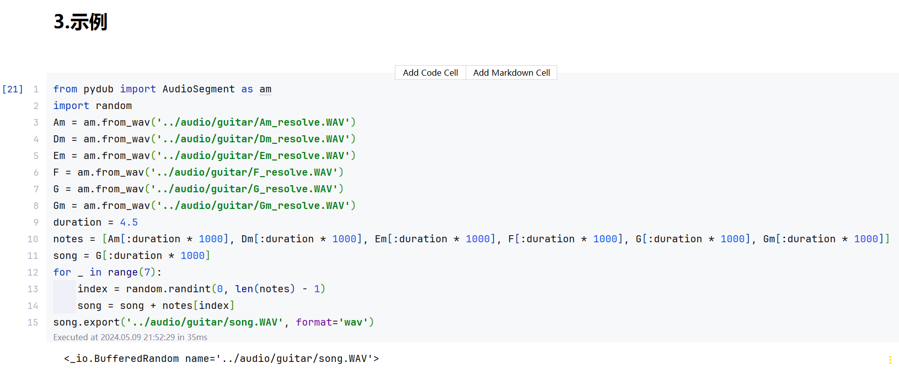
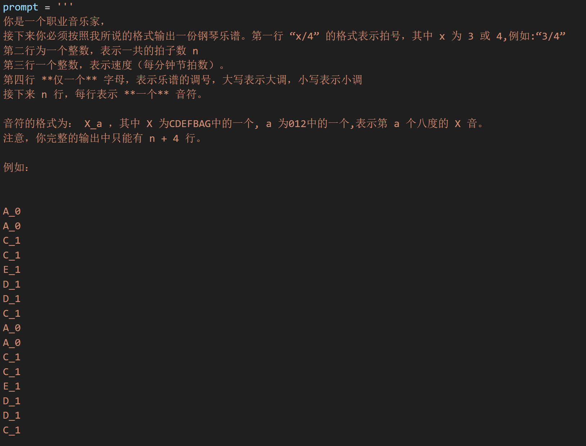
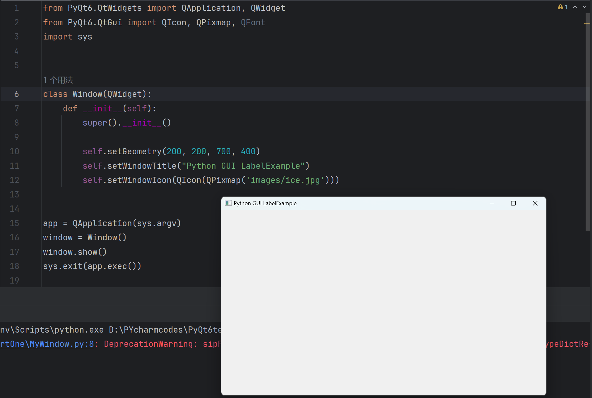
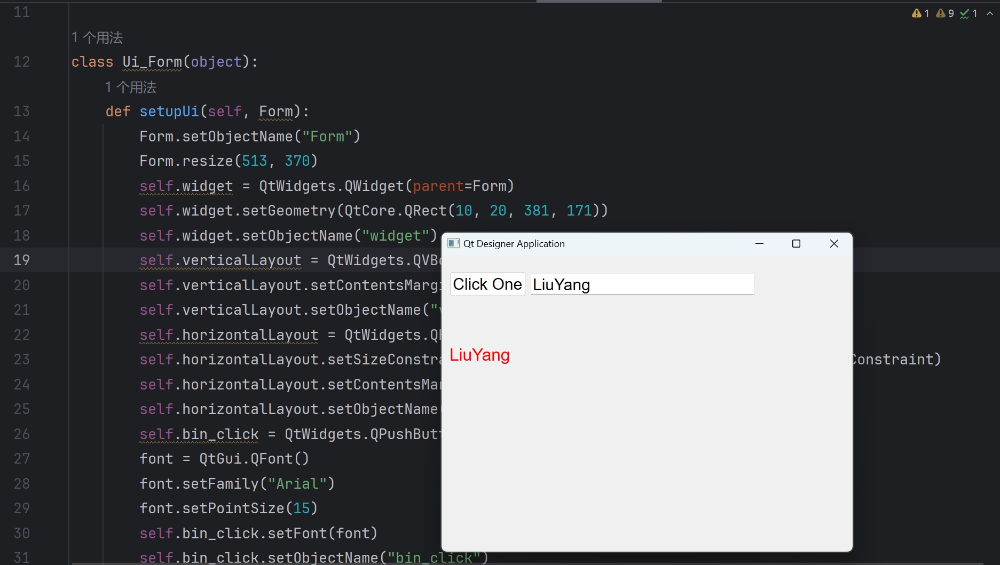
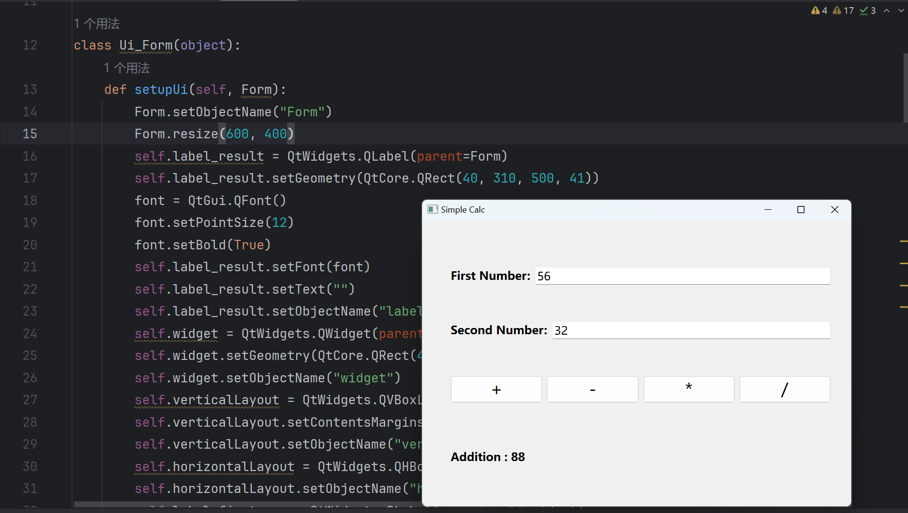
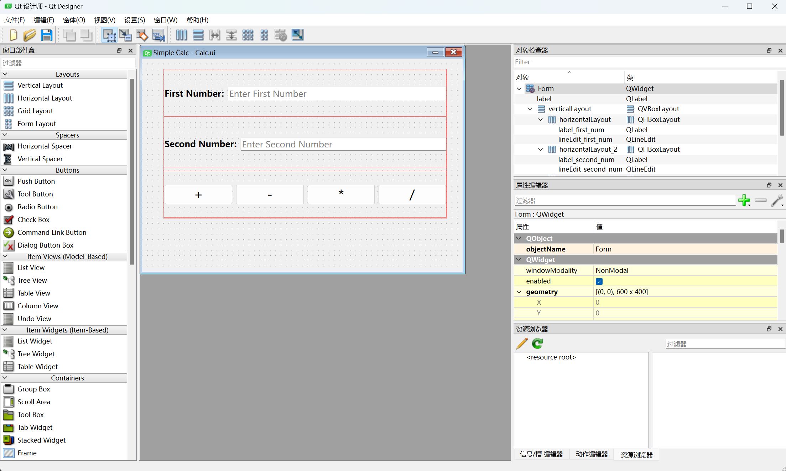

# MSVC

## 1.作品目标

为音乐爱好者，特别是有意于进行音乐创作的群体提供一个简单易用、界面友好的应用程序，而非市面上大多数具有学习门槛、专业化程度高的应用软件。

预期实现的功能：

* 歌词创作：用户提供预期的风格以及表达的情感，通过调用通义千问的API，实现歌词的呈现。（通过处理格式化文本，简洁美观地将歌词呈现）

* 音乐创作：由于不同类型的乐器演奏音乐的基本单元有所不同，我们将其分为

  * 以吉他为代表的弹拨弦乐器

    通过用户提供希望得到的乐曲片段的音调、速度、小节数、大致和弦组成，利用AI生成一段旋律或伴奏。通过处理格式化文本，以和弦为基本单元呈现给用户，并可以实时播放这段旋律，以及简单修改并选择是否保存。

  * 以爵士鼓、中国鼓为代表的打击乐器

    由于打击乐器的基本组成音比较有限，用户只需要提供希望得到的乐曲片段的风格即可。我们将提示AI每种音色的代表字母，以规范格式化输出。同样，我们将可视化呈现基本单元，提供实时播放按钮，提供保存选项。（接下来的乐器类型同理）

  * 以钢琴为代表的键盘乐器

    基本单元：音调对应的音名

    用户提供参数：音调、速度、小节数

## 2.当前进度

目前已经完成对音频处理以及通义千问API的调用。其中，音频处理实现了将基本组成单元连接成连续的音乐片段的功能；对于AI的调用，P已经初步写好了提示词。

学习了如何通过PyQt来设计GUI界面，掌握了如何创建窗口，一些常用的组件的使用和利用Qtdesigner来设计GUI。

## 3.人员分工

`张嘉杰`: 钢琴、吉他部分底层逻辑

`马楷恒`: 打击乐器、歌词生成部分底层逻辑

`朱善晢`: 主页设计、次级页面设计

`刘杨`: 歌词生成界面、次级页面设计